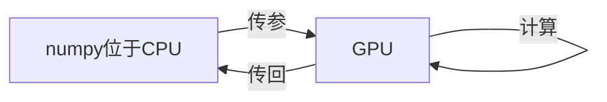

# lecture 8：深度学习软件

## CPU vs GPU

首先我们要明确的一点是，你不能拿cpu的核与gpu的核去比，cpu的单核要顶许多个gpu的单核。

但是如图中所示，gpu的核数实在是太多了，虽然它的单核能力比较弱，但是对于多核协同并行简单运算，它绝对可以吊打cpu。

一个很好的例子是在进行矩阵乘法时，这种简单的但是大量的运算gpu去搞在合适不过了，相对于cpu来说gpu对这种运算只能说super super fast。而在了解了深度学习后我们可以看到，深度学习本质上就是矩阵运算，无论什么花里胡哨的层都是在对于给定矩阵进行一个函数映射，所以在深度学习这个领域，gpu赢太多了。

### GPU编程：

刚刚还在思考，既然gpu是一个类cpu结构的自己拥有处理器的单元，那么是不是可以有gpu编程呢？

**他来了**

大名鼎鼎的cuda是gpu编程的一种方法。可以用类c的代码来直接在gpu上编程跑特定的计算。

而对于编写高效gpu代码是很困难的，所以有开源的库cuBLAS...一堆来供大家使用。

### 一个值得关注的问题：

一般来说，模型的参数是保存到gpu的显存当中的，而大量的数据是被保存在硬盘当中的。那么当gpu的处理速度相当快时，数据的传输速率就会成为限制运算速度的瓶颈。

解决这个问题一般使用多线程的方式将数据从硬盘中读到gpu中去，但是很复杂。

这是一个值得研究的好问题。

## Deep learning frameworks

使用框架是必要而且是唯一的选择。原因主要有两个：1.你写不出来稍复杂的代码  2.你写的python+numpy没法在gpu上跑

### Theano/TensorFlow

#### instance 

数据是以numpy传入的，意味着如果模型是跑在gpu上的话会经历从内存取数据到cpu进行准备，在gpu进行运算，再传回GPU的操作。这种数据传输很容易造成计算过程中的瓶颈。

**solution**：将w1与w2存为tensorflew中的变量，这样数据就会被存储在gpu中而不是在cpu中。

但是这样一来在求解时由于我们只求loss的值，实际上它是不随着反向传播来更新的。所以在我们将权重更新的过程声明成一个仿制节点，这样我们可以让tensorflew每次都必须更新权重的值。

（未添加时）

（添加后）

优化器：将我们之前的updates打包，岂不美哉。

**一些高级的包**

**layers**，**keras**

tansor board：可视化数据

### Torch/PyTorch

PyTorch定义了三种抽象：

**Tensor**: lmperative ndarraybut runs on GPU

**Variable**: Node in acomputational graph; storesdata and gradient

**Module**: A neural networklayer; may store state orlearnable weights

对标tensorflow

在具体的包的使用上，有：

Tensor与variable是随时可替换的。

可以自定义激活函数

torch.nn：高级包，用于将许多东西封装起来。包括model（将中间每一层封装），loss（loss的生成模式）

torch.optim：优化梯度求解方式的封装

DataLoader:可以使用多线程等方法来优化数据从硬盘的载入

pretrained model：

Visdom：可视化数据

### Caffe/Caffe2

一个用脚本语言去修改的框架，感觉不如上面两个。那么在这里对上面俩框架做个总结

### versus：

|      | tensorflew:静态                                  | pytorch:动态       |
| ---- | ------------------------------------------------ | ------------------ |
|      | 先建立计算图的数据结构，再用时进行初始化并计算。 | 定义过程即计算过程 |
|      | 方便部署于迁移                                   | 迁移起来麻烦一些   |
|      | 代码稍复杂                                       | 代码简洁           |
|      | maybe更适合工业（2017）                          | 更适合科研（2017） |

